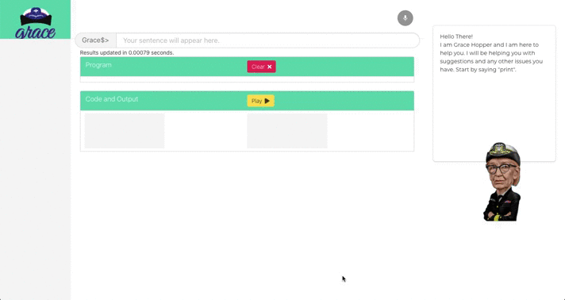

# GraceEngine - A Programming Engine



[](http://makeapullrequest.com)
[](https://github.com/kb-studios/GraceEngine/blob/master/LICENSE)
[](https://github.com/kb-studios/GraceEngine/issues?q=is%3Aissue+is%3Aclosed)


> *I love computer languages. In fact, I’ve spent roughly half my life nurturing one particular very rich computer language: Mathematica. But do we really need computer languages to tell our computers what to do? Why can’t we just use natural human languages, like English, instead?*
> -- Stephen Wolfram, creator of Mathematica.

Programming languages are a medium to communicate with computers.The question remains however, whether we need such cryptic languages in the first place. One answer as to why programming languages are everywhere is that they have structured, unambiguous syntaxes which make them an extremely efficient way to communicate with the computer. But this makes programming intriguing and boring, especially for beginners and business people. This application aims to tackle this particular issue by developing a tool which tries to simplify programming in general for such users. The project can be imagined in the following way - 

The user will speak out, i.e. by voice, a specific task that he wants to achieve in natural language, for example

> Assign value 10 to a. Let b equals 20. Add a and b and store it in c. Print the value of c.

will be converted to Python/C code which looks something like this. 

```python
a=10
b=20
c=a+b
print(c)
```

Why convert the spoken sentences to a particular programming language? Natural language is, by itself, very ambiguous and does not fully express the idea in a format a computer can understand. By using techniques like natural language understanding, these statements can be mapped to a programming language code, thus providing the user a “flexibility to edit” certain ambiguous statements by editing the code.

### The aim (Social Relevance)
This project is seen as an automation tool that helps making programming easier and faster. (Why faster? - An average person can speak at about 140-150 wpm, where as a typist has an efficiency of 40-50 wpm.) It can also be seen as a great assistant for people with disabilities in arms, people suffering from diseases like RSI, etc. But at a greater level, this is seen as a future era of programming where programming will be more natural, and it will not just be a tool that a group of software developers will be using to automate stuff, but students, academicians, business people and also a general public who will be using programming every day to perform some task or the other. Programming will be as natural as making coffee, and everyone will be able to do it.


### Project outcomes
A single statement that a user speaks can be as simple as a print command like “Print hello world” or a statement which performs a complex function like “Define a function to reverse a string”.These two cases will be handled differently. To handle the first statement, we plan to create intents and map them to all major programming constructs like assignments, arithmetic operations, loops, functions and so on. The second case will depend heavily on large datasets of code. Large repositories of code like Github may have many snippets which can be used to directly to get results. An optimal data structure can be created which will make loading of these snippets faster and more accurate.

## Insturctions for Collaborators

> **Note:** This project is well tested on Ubuntu 18.04 OS. If you face compatibility issues on other OS, try fixing the error by yourself first, if not possible, make it as a issue.

To setup the development environment, follow these steps.

1. Setup a virtual environment for python using [Anaconda](https://www.anaconda.com/download/#linux) or similar tools. Make sure the python version is 3.6+.

`conda create -n grace python=3.6`

2. Install the dependencies using the [requirements.txt](requirements.txt) file.

`pip install -r requirements.txt`

3. To run the API server, run the following command after the dependencies are installed.

`gunicorn --pythonpath api api:app -b localhost:5000`

This will start a local API server at [127.0.0.1:5000] (Visiting this using a browser won't do anything).
Keep this running and open a new terminal tab for running the frontend npm server.

4. Go to the app directory and install dependencies.

```
cd app
npm install
```

5. Run the frontend server
`npm run serve`

This step takes a while. The webapp can then be opened at http://localhost:8080. Have fun :)

#### Footnotes

This project was named after [Grace Hopper](https://en.wikipedia.org/wiki/Grace_Hopper)

[](https://www.python.org/)

